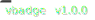

# vbadge
A svg version badge generator, like current version for vbadge 

# run

`docker run -p 3000:3000 ghcr.io/aptkode/vbadge:latest`

# features

generate badage by artifactId and version
- `/:artifactId/:version`

generate badage by raw pom
- `/pom?url={url-encoded-raw-pom-file-url}`
